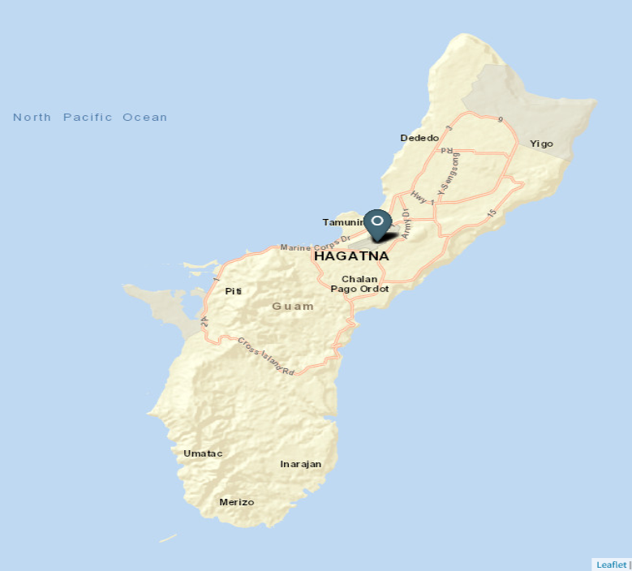
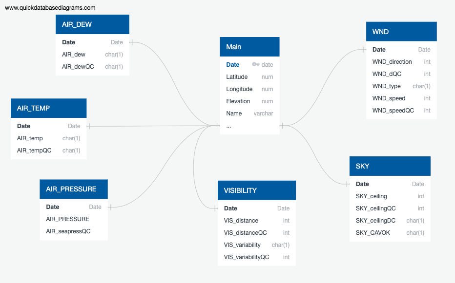
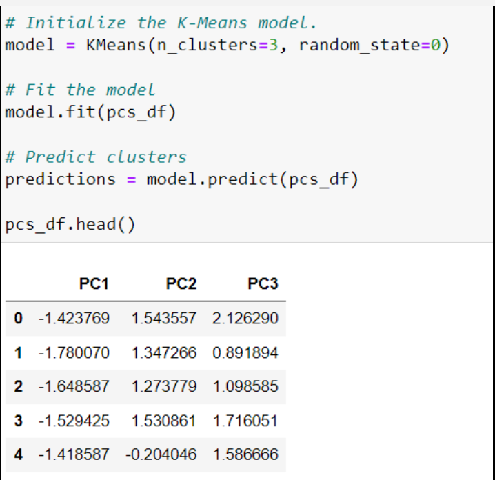
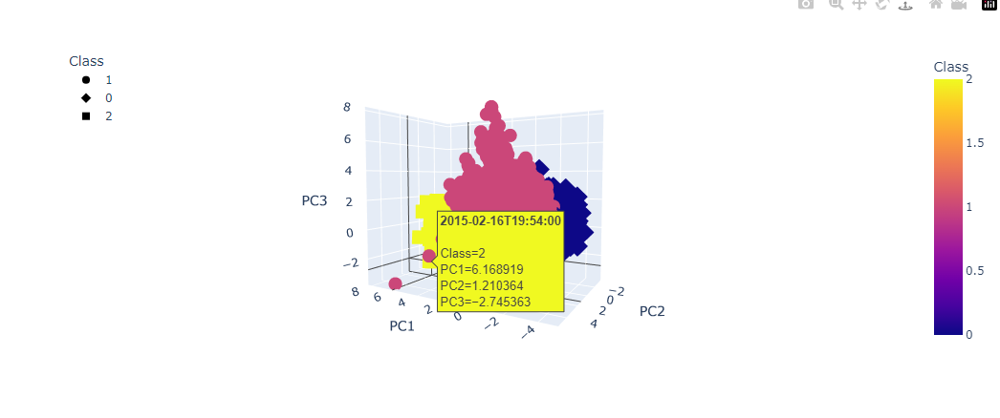
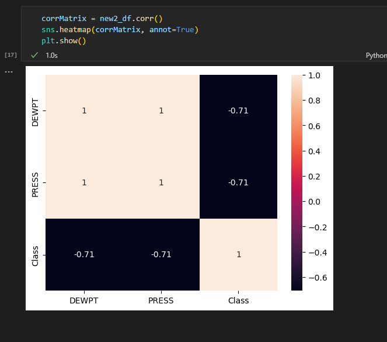

# Project Overview:

## About our Team
Group 1 members:
Valerie Chau (point of contact),
Taylor Dacpano,
Ludivina LeMay,
Heather Hutchinson,
Tyee Montoya

## Why study Climate Change?
Using the US territory Guam as an example of a small area affected greatly by the climate changes caused by major users of oil and gas worldwide, we will look at the past climate data and future data projections for Guam. We are likely to use temperatures and precipitation to start with. If we can find other data about Guam and how climate change is affecting them, we will incorporate that data as well in order to draw a more complete picture of how climate change is expected to affect this territory and in  hopes of being able to suggest what we can do to help Guam cope with their changing climate is ways that help their humaan population thrive. The idea is to understand how very small territories and nations are adversely being affected by what the most powerful nations are doing to harm our planet in hopes of educating more people to start taking climate changes seriously now in order to prevent harm and destribution of our shared planet.

## Interesting facts about Guam
Guam is an organized, unincorporated territory of the United States in the Micronesia subregion of the western Pacific Ocean. Guam's capital is Hagåtña, and the most populous village is Dededo. Guam became a U.S. territory in 1898 and placed under the jurisdiction of the U.S. Navy. The Guam Organic Act of 1950 conferred U.S. citizenship on Guamanians and established the territory's government. The Act also transferred Federal jurisdiction over Guam from the U.S. Navy to the Department of the Interior. Here are some interesting facts about Guam:  https://www.dewittguam.com/an-independent-territory-guams-american-history/

## Our Story
As a group, we wanted to focus on a topic that would be of interest to everyone in the group.  Our topic of interest became climate change because it can affect people, cities, and farming. Papayas, bananas, coconuts, breadfruit, mangoes, guavas, mountain apples, limes, and tangerilles flourish in the island's ideal tropical climate.

Using Guam as an example, we looked at past climate data based on temperature, precipitation, visibilty, sea level pressure and more.  We focused on Guam because it is a small island whose people are directly affected by what larger nations are doing.  US national defense spending is the main driver of Guam's economy, followed closely by tourism and other services. 

Our question for this project was whether we can predict climate data for Guam for the year 2024 from past years' data 2013 - 2023.  Our hope is that we can use the measurements of how climate change is affecting the Guam over the past 10 years to predict what their next few years will be like, so that people can be educated world wide about how the devasting effects of climate change are affecting small territories and nations. 

## Data Source
Since most of the people in Guam (other than US military personnel) live and work around the international airport, weather data from that station was obtained. According to the pacific farmer organizations, “ The farms of subsistence and small commercial producers are primarily located in the villages of Barrigada, Dededo, Merizo, Mangilao, and Yigo”. These areas are located around Guam's interntional airport. 

The data comes from the National Centers for Environmental Information National Oceanic and Atmospheric Administration (NOAA). We collected a total of 11 CSV files to analyze about 10 years of climate data for Guam.  The data contains information about liquid precipitation, sea level pressure, temperatures, wind, atmospheric pressure, relative humidity and more. We also gathered data from National Centers for Environmental Information. 

## Extract, Transform, and Load (ETL) Process
A total of 11 csv files were extracted from NOAA.  During the transformation process, the unnecessary columns were removed.  Further data transformation was done using python to split columns and more. For the loading phase, an Entity Relation Diagram (ERD) was created online using Quick DBD.  The schema can be found in the resources folder.   The clean climate data was then loaded into a PostgreSQL Database.  Tables for the clean data were then created. 

The schema can be found in the resources folder.   The clean climate data was then loaded into a PostgreSQL Database.  Tables for the clean data were then created. 

## Machine Learning 
Six specific climate variables were obtained from our postgreSQL database tables, loaded into a DataFrame, their values standarized, and an elbow curve was created. Based on that, the KMeans model with k=3 was used. Overall, unsupervised machine learning was selected for this project. Pandas, Jupyter notebook, and visual studio were used to preprocess the dataset for Principal Component Analysis (PCA) algorithm. Our data contained time series data that is usually analyzed with other algorithms that are beyond the scope of this course, so we used the unsupervised machine learning model.

The following is a brief visual summary of the workflow for this model. 

A correlation matrix was used to visualize the correlation coefficient between all-weather features.

## Data Visualization
We will use Tableau for this project's visualizations. Data was uploaded into the Tableu, worksheets were created to work with the data, and dashboards were created to arrange the visuals.  Finally, an overall story was created using the dashboards.  Here is the link to our dashboard <https://public.tableau.com/shared/YY85W397W?:display_count=n&:origin=viz_share_link>

   The first dashboard that we created displayed the relationship between Wind Speed and Wind Direction over the last ten years. The top chart captures the wind's average direction between each year in angular degrees in a clockwise direction. The year 2015 had the highest average wind movement of 136 angular degrees. This would be equivalent to winds pushing in a SouthEast direction. This year, 2023, has experienced less movement with a average wind direction of 86 angular degrees, which is equivalent to winds pushing East. 

   
   

## Conclusion
Guam's climate showed some change by season by not so much by years. More to come.

## Resources
Data was obtained from the National Centers for Environmental Information (NOAA)
https://www.ncei.noaa.gov/access/search/data-search/global-hourly

Reports on the effects of Climate Change for Guam 
Here is a 2020 report on how climate change is affecting Guam: 
https://scholarspace.manoa.hawaii.edu/server/api/core/bitstreams/82772ba9-def5-415e-99ce-73804034b077/content

Here is an earlier report (2016) on how climate changes affected Guam:
https://www.epa.gov/sites/default/files/2016-09/documents/climate-change-gu.pdf

## Communication
We used a channel on the class Slack to communicate.  We also used the designated class time.  

